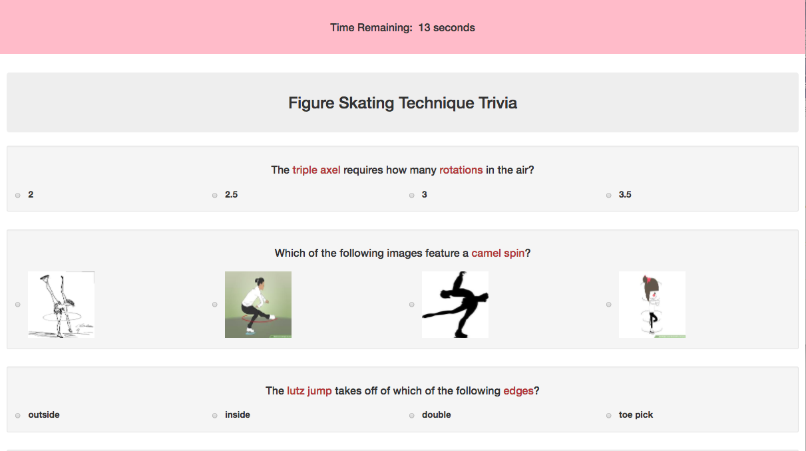

# TriviaGame
(HTML, CSS, Bootstrap, JQuery)
### Interesting features / thoughtfulness behind TriviaGame
* Greater area/space for users to click: either radio buttons or answer choices may be clicked
* Visually stimulating: some answer choices are in the form of images
* Key words (which may be overlooked by users) are emphasized with Bootstrap's `text-danger` class
* Two cases will cause the clock to stop decrementing: either after it displays `0 seconds` (using if/else statements), or when the user clicks the `submit` button (using the `on` method)
* The `css` method is used to hide or display HTML elements; this means that the entire hard-coded game component is within a single HTML file, rather than multiple HTML pages
* The various functions of the game (eg. updating the time on a clock, grading the questions) are in the form of methods within overarching objects (eg. `updateClockDisplay` method within `clockDisplay` object; `grade` method within `over` object)
* All answer-choice images are saved within the `assets/images` directory, rather than retrieved from a website; this prevents the unfortunate situation in which an image disappears from the quiz (because, for example, the website took it down)

